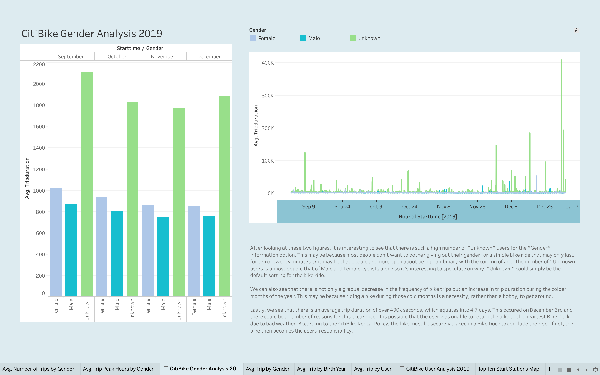
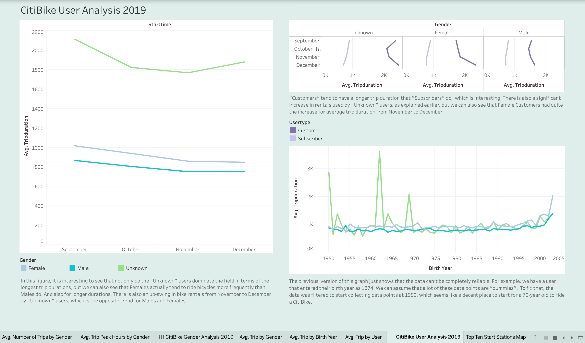

# Tableau Homework - Citi Bike Analytics

## Data Source
CSV Files from June to December of 2019 were collected from [Citi Bike Data](https://www.citibikenyc.com/system-data) webpage.

## Visualizations
https://public.tableau.com/app/profile/cheyennemar/viz/CitiBike_Analysis_16313395465220/CitiBikeTopTenAnalysis

## Analysis
1. Average Trips and Peak Hours for Genders
"Unknown" genders nearly double that of Male and Female CitiBike users. There are more "Customers" than "Subscribers", with "Unknown" gender users being the group with the longest averge trip durations.

2. User Analysis for Genders and Age
As expected, there is a decrease in trip rides with the colder season, but there is a slight increase for the "Unknown" gender from November to December. "Customer" tend to have longer drip rides that "Subscribers" do. The data can be unrealiable. There was a data point entry for the birth year of 1874, which is not possible for 2021.

3. Top Ten Analysis
Pershing Square North is the most popular "Start" and "Stop" Station. Top four Stations are the same across the board.
1[Top Ten Analysis](Images/top_ten.png)

## Rubric

[Unit 20 Rubric - Tableau Homework - Citi Bike Analytics](https://docs.google.com/document/d/135gKIRxE8XB9XGmXcGORGpmJAeGdh1qz6ogh8na6P-o/edit?usp=sharing)

- - -

© 2021 Trilogy Education Services, LLC, a 2U, Inc. brand. Confidential and Proprietary. All Rights Reserved.
